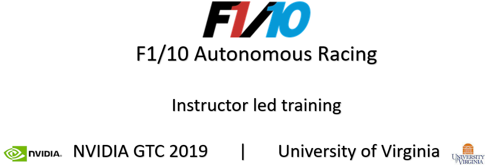
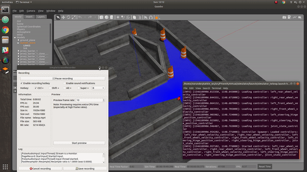
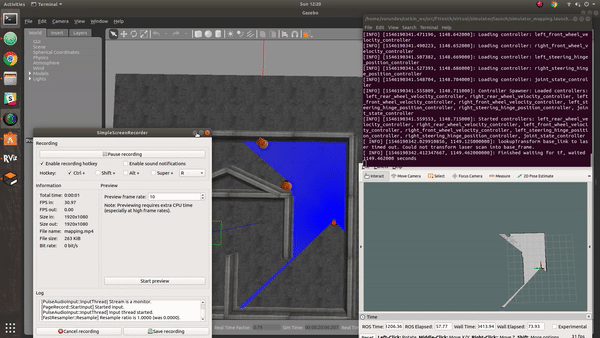

<p align="center">

</p>


### What is F1/10 Autonomous Racing?

F1/10 is an international autonomous racing competition which exposes the participants to the foundations of perception, planning and control in a fun, and challenging environment. Participating teams race vehicles with similar hardware specification and try to outsmart, and outpace each other in a battle of algorithms. We’re bringing together two dozen of the top research labs and tech institutions from around the world who have built F1/10 till date.

Few things focus the mind and excite the spirit like a competition. In the early days of racing, competitors first had to build their vehicles before they could race them. It was thus as much an engineering as a racing competition. We want to rekindle that competitive spirit for autonomous systems.

### Highlights from the 3rd F1/10 Autonomous Racing Competition

[Ctrl/Cmd + Click image below to open video in a new tab.]

[](http://www.youtube.com/watch?v=VlE2Wb_XhoQ "F1/10 Autonomous Racing Competition 2018 - Torino, Italy")

## Tutorial Summary:
- F1/10 Gazebo racing simulator
- Perception - LIDAR, and Camera - in *rviz*
- Simple Navigation - Wall following and PID steering and velocity control
- Simultaneous Localization and Mapping (SLAM) using Hector SLAM
- Building and saving maps with LIDAR scan data
- Localization using the Adaptive Monte Carlo (AMCL) method
- Path planning and waypoint navigation using Time-Elastic Band (TEB) local planner.


## F1/10 Hardware Testbed Summary
### Note: Hardware testbed is not required for this tutorial


The F1/10 platform is designed to meet the following requirements:

1. The platform must be able to capture the  dynamics  of  a  full  scaled  autonomous car;  
2.  The platform's hardware and software stack must be modular so as to enable easy upgrades, maintenance and repairs and
3. The platform must be self-sustaining in terms of power, computation and sensors, i.e., it need not use any external localization

The testbed contains the following hardware:

* 1/10 scale rally racecar chassis with Ackerman steering from Traxxas
* Hokuyo 10LX LIDAR rangefinder
* Nvidia Jetson TX2 module
* Orbitty carrier for TX2
* ZED depth camera
* Vedder Electronic Speed Controller (VESC)
* MPU-9050inertial measurement unit (IMU)
* Ubiquiti Wifi Pico station access point

Detailed instructions on how to assemble the testbed are available on our [website](f1tenth.org)

## Installation Steps
The instructions below are for Ubuntu 18.04 LTS Bionic and ROS Melodic Morenia.
If using a different Linux/ROS setup please use the corresponding ROS version instead of the melodic commands below.

### 1. Install Robot Operating System (ROS)
If your computer dos not have ROS already installed, you can do so by following the instructions [here](http://wiki.ros.org/melodic/Installation/Ubuntu). Choose the 'desktop-full' install option as we will use the navigation libraries and visualization tools.

### 2. Create a ROS workspace

You have to create a local directory to contain the F1/10 and its dependent packages and permanently source them.
To do this, open a new terminal window and do the following:

```console
user@computer:$ mkdir -p catkin_ws/src/
user@computer:$ cd catkin_ws/src/
user@computer:$ catkin_init_workspace
user@computer:$ cd ~/catkin_ws
user@computer:$ catkin_make
user@computer:$ echo "source ~/catkin_ws/devel/setup.bash" >> ~/.bashrc
```

### 3. Install the F1/10 package and its dependencies

1. Install the navigation libraries using apt-get
You have to install certain navigation libraries and some additional packages to support the simulator. You can do this by opening a new terminal and typing:
```console
user@computer:$ sudo apt-get -y install ros-melodic-ros-control
user@computer:$ sudo apt-get -y install ros-melodic-gazebo-ros-control
user@computer:$ sudo apt-get -y install ros-melodic-ros-controllers
user@computer:$ sudo apt-get -y install ros-melodic-navigation qt4-default
user@computer:$ sudo apt-get -y install ros-melodic-ackermann-msgs
user@computer:$ sudo apt-get -y install ros-melodic-serial
user@computer:$ sudo apt-get -y install ros-melodic-teb-local-planner*
```
The * trailing the command install the packages using the same name that are some times dependent on the master package.

2. Install the mapping and core package using catkin_make
With all the dependencies installed, you can now install the F1/10 core package (with the simulator) and the rest of the packages necessary to run the nodes locally. To do so, open a new terminal and execute:

```console
user@computer:$ git clone https://github.com/linklab-uva/f1tenth_gtc_tutorial
user@computer:$ ln -s ~/f1tenth_gtc_tutorial/src/ ~/catkin_ws/src/
user@computer:$ cd ~/catkin_ws
user@computer:$ catkin_make install
```

## Getting Started with F1/10 Tutorials

The F1/10 package provides a F1/10 Gazebo Simulator which complements the hardware by emulating its modular properties. The repository has been setup to help the user get started with the simulator out-of-the box. This section provides a quick dive into the three main sections of the tutorial;

The simulation sub-package contains one-line commands that perform these tasks parallelly, but we recommend that first-time users understand the processes before using these commands. If you are already experienced in ROS, the launch files are present under '/simulator/launch' directory.

### Getting familiar with the F1/10 Gazebo simulator



The F1/10 Gazebo simulator contains features like the a world map, and Gazebo plugins that provide better odometry and control. This setup utilizes the MIT-Racecar gazebo simulation baseline implementation.
To bring up the F1/10 Gazebo simulator using the following command

```console
user@computer:$ roslaunch racecar_gazebo racecar.launch
```

You should now see the default F1/10 world loaded into Gazebo and see the red F1/10 simulated car with the blue LIDAR rangefinder visualized.

#### Keyboard control [Tele-operation]

The F1/10 console package provides you with the option of using either keyboard control or joystick control. The package is built around the Logitech F710 game controller or the standard English(US) keyboard. IF you do not have the F710, you can use any other controller supported by the ROS joy-node and change the axis-mapping or just use the keyboard control by using the following command:

```console
user@computer:$ roslaunch console keyboard_teleop.launch
```
Keyboard control in this package follows the WASD pattern:
W: Move forward
S: Move reverse
A: Turn left
D: Turn right

NOTE: When using *keyboard_teleop*, always keep the terminal from which the teleop node was initialized as the active terminal window over other screens, otherwise the keyboard data will not be sent to the car.
You should now be able to see the car respond to manual control commands - steering, and accelration.

### Tutorial 1: Basic navigation principles (wall following)


The purpose of this demonstration is to show the basic perception, planning, and control capabilities of the F1/10 Gazebo platform.  
Our goal is to go from manual control to autonomous control on the F1/10 racecar.
To do this, we will implement a wall following algorithm. The algorithm will try to track either the inner or the outer walls of the world, and maintains a fixed distance from them using the LIDAR rangefinder sensor and using Proportional, Integral, and Derivative (PID) control.

First, bring up the simulator using the following command. This command launches the simulator and spawns the F1/10 racecar closer to the inner wall for better performance of the wall-following algorithm.

```console
user@computer:$ roslaunch racecar_gazebo racecar_simplerun.launch
```

Next, Bring up the wall-following ROS nodes using the following command.
You should notice the F1/10 racecar moving immediately.

```console
user@computer:$ roslaunch simulator simple_run.launch
```

To adjust the distance from the wall, you can change the values in the '/src/f1tenth/virtual/simulator/nodes/simple_run/pid_error.py'
For example, like so :

```python
DESIRED_DISTANCE_RIGHT = 1.0 # distance from right wall in meters
DESIRED_DISTANCE_LEFT  = 0.8 # distance from left wall in meters
```

### Tutorial 2: Simultaneous Localization and Mapping [SLAM] using Hector Mapping



Note: It is important that you do not have multiple installations of hector_slam package. ROS will not build multiple packages with the same name, but sometimes it can overlook existing installations if your workspace is not sourced.

Before we proceed to mapping, we have to make some changes to the hector_slam launch files to make it work with the F1/10 package. To do so, execute the following commands in a new terminal:

```console
user@computer:$ roscd hector_mapping/launch/
user@computer:$ gedit mapping_default.launch
```

Make the following changes to the mapping_default.launch file:

1. Change the name of *base_frame*
```xml
ln 5: <arg name="base_frame" default="base_footprint"/>
to
ln 5: <arg name="base_frame" default="base_link"/>
```

2. Change the value for *odom_frame*
```xml
ln 17: <param name="odom_frame" value="$(arg odom_frame)"/>
to
ln 17: <param name="odom_frame" value="$(arg base_frame)"/>
```

The *hector_mapping* package launches with some default parameters and the changes made by the steps above enable us to use this package with our platform.

Once you have completed all the steps above, it is time to explore the simulated world and create a 2D map of the world. For this, you should first bring up the simulator with the default 'racecar.launch' file. Do the following:

```console
user@computer:$ roslaunch racecar_gazebo racecar.launch
```

Once the simulator GUI appears, check the console to verify that there are no errors. This is important because although the simulator would seem to be working properly, some of the nodes necessary to control the F1/10 racecar might have not launched. If the console output has no red lines, you are safe to proceed to the next step. Otherwise use Ctrl-C to kill the simulator and relaunch the entire package. The simulator has to shutdown clearly, otherwise the errors will propagate again.

Now it is time to launch the *keyboard_teleop* ROS node (or *joystick_teleop*, if you have a compatible joystick). We will use this ROS node to manually drive the car around the environment so that the mapping nodes can collect LaserScan data and build the map. Open a new terminal (different from the one which you used to launch the simulator) and launch the teleop node using:

```console
user@computer:$ roslaunch console keyboard_teleop.launch
```

Next, launch the mapping nodes. We will use *hector_mapping* to accomplish this by running the following command in a new terminal. Read more about *hector_mapping* and the ROS Hector SLAM package [here](http://wiki.ros.org/hector_slam).

```console
user@computer:$ roslaunch platform mapping.launch
```

With the mapping node, simulator, and the teleop node running, it is time to visualize the data. For this we use the ROS inbuilt visualization tool called *rviz*. The F1/10 package contains an *rviz* configuration file that opens up the correct parameters to visualize mapping data. You can take advantage of this configuration file by running the following command:

```console
user@computer:$ roslaunch console mapping.launch
```
You should now see the initial 2D map built by the car from the current laser scan data in *rviz*. As you drive the car using the teleop terminal and the WASD keys, you should see the *rviz* map getting updated as more parts of the world come into the field of view of the LIDAR.

Once you have driven around the environment, you should notice that a closed map is generated using the *rviz* visualization tool. It is not necessary to drive the entire loop manually as partial maps are also good enough for the next step. We now proceed to save the map generated using the following command:

```console
user@computer:$ rosrun map_server map_saver -f <name_for_your_map>
```

You should now see a map file in your home directory. You can save the map file using any name you choose, but you should keep track of what map you want to use for the next tutorial. The F1/10 package already contains a full standardized map of the environment and will use that map for navigation.

### Tutorial 3: Advanced navigation using the TEB local planner


The F1/10 platform is based on a 1/10 scale RC car with [Ackermann steering](https://en.wikipedia.org/wiki/Ackermann_steering_geometry) and therefore requires a navigation system better suited for its dynamics. For this, we chose the official ROS package for [TEB local planner](http://wiki.ros.org/teb_local_planner). The follow demonstration shows how this navigation stack works.

First, bring up the simulator using the following command in a new terminal.

```console
user@computer:$ roslaunch racecar_gazebo racecar.launch
```

Next, launch the navigation stack. The following command must be entered in a new terminal and it launches several nodes including:

```console
navigation
    |
    |-----> AMCL (Adaptive Monte Carlo Localization)
    |
    |-----> global planner based on global costmap
    |
    |-----> local planner based on local costmap
    |
    |-----> robot controller
```

A successful launch will not produce any red lines in the terminal window. The four processes launched with this command are meant to sequentially localize the robot based on it's initial pose in the know map and keep track of the robot as it moves in the map. The route planners generate trajectories for the robot to travel from it's current location to the goal. Finally, the robot controller translates the plan into action.

```console
user@computer:$ roslaunch platform navigation.launch
```

As with mapping, the F1/10 package contains an *rviz* configuration file that launches the visualization window with parameters necessary for navigation. You can bring up this window by entering the following command in a new terminal. Once the GUI is launched, you can use the 2D nav goal option and click on any point within the map to send a goal to the robot and observe the robot achieve its objectives.

```console
user@computer:$ roslaunch console navigation.launch
```

## F1/10 Crew at Univerisity of Virginia
Instructor:\
Dr. Madhur Behl\
Assistant Professor\
Computer Science | Systems and Information Engineering\
madhur.behl@virginia.edu

Teaching Assistant:\
Varundev Suresh Babu\
PhD Candidate\
Computer Science\
varundev@virginia.edu
