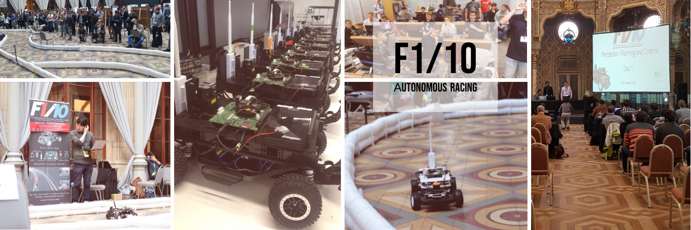
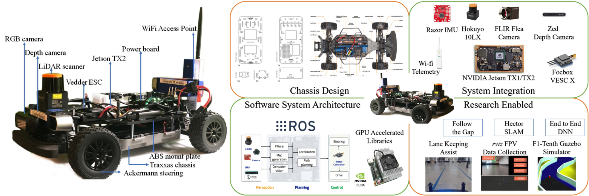

<p align="center">

# F1/10 Autonomous Racing
## Instructor led training
</p>
##  Nvidia GTC 2019 | University of Virginia  



### What is F1/10 Autonomous Racing?

F1/10 is an international autonomous racing competition which exposes the participants to the foundations of perception, planning and control in a fun, and challenging environment. Participating teams race vehicles with similar hardware specification and try to outsmart, and outpace each other in a battle of algorithms. We’re bringing together two dozen of the top research labs and tech institutions from around the world who have built F1/10 till date.

Few things focus the mind and excite the spirit like a competition. In the early days of racing, competitors first had to build their vehicles before they could race them. It was thus as much an engineering as a racing competition. We want to rekindle that competitive spirit for autonomous systems.

### Highlights from the 3rd F1/10 Autonomous Racing Competition

[Ctrl/Cmd + Click image below to open video in a new tab.]

[](http://www.youtube.com/watch?v=VlE2Wb_XhoQ "F1/10 Autonomous Racing Competition 2018 - Torino, Italy")

## Tutorial Summary:
- F1/10 Gazebo racing simulator
- Perception - LIDAR, and Camera - in Rviz
- Simple Navigation - Wall following and PID steering and velocity control
- Simulataneous Localization and Mapping (SLAM) using Hector SLAM
- Building and saving maps with LIDAR scan data
- Localization using the Adaptive Monte Carlo (AMCL) method
- Path planning and waypoint navigation using Time-Elastic Band (TEB) local planner.


## F1/10 Hardware Testbed Summary
### Note: Hardware testbed is not required for this tutorial



The F1/10 platform is designed to meet the following requirements:

1. The platform must be able to capture the  dynamics  of  a  full  scaled  autonomous car;  
2.  The platform's hardware and software stack must be modular so as to enable easy upgrades, maintenance and repairs and
3. The platform must be self-sustaining in terms of power, computation and sensors, i.e., it need not use any external localization

The testbed contains the following hardware:

* 1/10 scale rally racecar chassis with Ackerman steering from Traxxas
* Hokuyo 10LX LIDAR rangefinder
* Nvidia Jetson TX2 module
* Orbitty carrier for TX2
* ZED depth camera
* Vedder Electronic Speed Controller (VESC)
* MPU-9050inertial measurement unit (IMU)
* Ubiquiti Wifi Pico station access point

Detailed instructions on how to assemble the testbed are available on our [website](f1tenth.org)

## Installing
Based on the current configuration of your computer, you will have to install more than just the F1/10 package

### 1. Install ROS
If your computer dos not have ROS already installed, you can do so by following the instructions [here](http://wiki.ros.org/melodic/Installation/Ubuntu). Choose the 'desktop-full' install option as we will use the navigation libraries and visualization tools.
### 2. Create local workspace

You have to create a local directory to contain the F1/10 and its dependent packages and permanently source them. To do this, open a new terminal and do the following:

```console
user@computer:$ mkdir -p catkin_ws/src/
user@computer:$ cd catkin_ws/src/
user@computer:$ catkin_init_workspace
user@computer:$ cd ~/catkin_ws
user@computer:$ catkin_make
user@computer:$ echo "source ~/catkin_ws/devel/setup.bash" >> ~/.bashrc
```

### 3. Install F1/10 package and its dependencies

1. Install navigation libraries using apt-get
You have to install certain navigation libraries and some additional packages to support the simulator. You can do this by opening a new terminal and typing:
```console
user@computer:$ sudo apt-get -y install ros-melodic-control*
user@computer:$ sudo apt-get -y install ros-melodic-gazebo*
user@computer:$ sudo apt-get -y install ros-melodic-navigation
user@computer:$ sudo apt-get -y install ros-melodic-teb-local-planner*
user@computer:$ sudo apt-get -y install ros-melodic-serial*
```
The * trailing the commands install the packages using the same name that are some times dependent on the master package.

2. Install mapping and core package using catkin_make
With all the dependencies installed, you can now install the F1/10 core package (with the simulator) and the rest of the packages necessary to run the nodes locally. Open a new terminal and execute:

```console
user@computer:$ git clone https://github.com/linklab-uva/f1tenth_gtc_tutorial
user@computer:$ ln -s ~/f1tenth_gtc_tutorial/src/ ~/catkin_ws/src/
user@computer:$ cd ~/catkin_ws
user@computer:$ catkin_make install
```

## Getting Started

The F1/10 package complements the hardware by emulating its modular properties. The repository has been setup to help the user get started with the simulator out-of-the box. This section provides a quick dive into the three main sections of the tutorial;

The simulation sub-package contains one-line commands that perform these tasks parallelly, but we recommend that first-time users understand the processes before using these commands. If you are already experienced in ROS, the launch files are present under '/simulator/launch' directory.

### The F1/10 simulator

The F1/10 simulator is based on the work done by the MIT-Racecar team with some added features like the new world map and Gazebo plugins that provide better odometry and control. Bring up the simulator using the following command.
```console
user@computer:$ roslaunch racecar_gazebo racecar.launch
```

The F1/10 console package provides you with the option of using either keyboard control or joystick control. The package is built around the Logitech F710 game controller or the standard English(US) keyboard. IF you do not have the F710, you can use any other controller supported by the ROS joy-node and change the axis-mapping or just use the keyboard control by using the following command.
```console
user@computer:$ roslaunch console keyboard_teleop.launch
```

### Tutorial 1: Basic navigation principles (follow the inner wall)

The purpose of this demonstration is to show the basic capabilities of the F1/10 platform. If you already have the assembled F1/10 hardware, you can skip the first part and proceed directly to the second part. You may need to tune some basic parameters in the controller depending on the kind of chassis you are using.

First, bring up the simulator using the following command. This command launches the simulator and spawns the F1/10 racecar closer to the inner wall for better performance of the wall-following algorithm.

```console
user@computer:$ roslaunch racecar_gazebo racecar_simplerun.launch
```

Bring up the wall-following nodes using the following command. You should notice the F1/10 racecar moving immediately.

```console
user@computer:$ roslaunch simulator simple_run.launch
```

To adjust the distance from the wall, you can change the values in the '/src/f1tenth/virtual/simulator/nodes/simple_run/pid_error.py' like the following:

```python
DESIRED_DISTANCE_RIGHT = 1.0 # distance from right wall in meters
DESIRED_DISTANCE_LEFT  = 0.8 # distance from left wall in meters
```

### Tutorial 2: Mapping a closed environment using Hector Mapping

It is important that you do not have multiple installations of hector_slam package. ROS will not build multiple packages with the same name, but sometimes it can overlook existing installations if your workspace is not sourced.

Before we proceed to mapping, we have to make some changes to the hector_slam launch files to make it work with the F1/10 package. To do this execute the following:

```console
user@computer:$ roscd hector_mapping/launch/
user@computer:$ gedit hector_mapping.launch
```

Make the following changes to this file:

1. Change the name of *base_frame*
```xml
ln 5: <arg name="base_frame" default="base_footprint"/>
to
ln 5: <arg name="base_frame" default="base_link"/>
```

2. Change the value for *odom_frame*
```xml
ln 17: <param name="odom_frame" value="$(arg odom_frame)"/>
to
ln 17: <param name="odom_frame" value="$(arg base_frame)"/>
```

```console
user@computer:$ roslaunch racecar_gazebo racecar.launch
```

```console
user@computer:$ roslaunch console keyboard_teleop.launch
```

```console
user@computer:$ roslaunch platform mapping.launch
```

```console
user@computer:$ roslaunch console mapping.launch
```

```console
user@computer:$ rosrun map_server map_saver -f <name_for_your_map>
```

### Tutorial 3: Advanced navigation using the TEB local planner

```console
user@computer:$ roslaunch racecar_gazebo racecar.launch
```

```console
user@computer:$ roslaunch platform navigation.launch
```

```console
user@computer:$ roslaunch console navigation.launch
```
